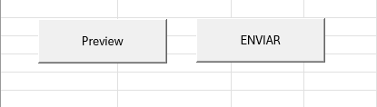
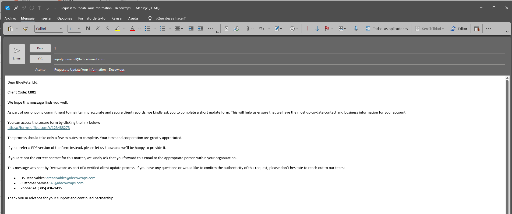

# ✉️ Bulk Email Sender & Outlook Automation (Excel VBA)

Este proyecto es una solución empresarial desarrollada en **Excel VBA** diseñada para automatizar, estandarizar y optimizar el proceso de comunicaciones masivas y personalizadas a clientes. La herramienta se integra de manera nativa con **Microsoft Outlook**, permitiendo el envío de reportería financiera, estados de cuenta y notificaciones de cobranza de forma segmentada, reduciendo los tiempos de ejecución manual en más de un 80%.

---

## 🚀 Funcionalidades Clave

* **Segmentación y Personalización Dinámica:** Capacidad de extraer variables específicas por fila (Nombre, Saldos, Fechas de Vencimiento) para inyectarlas directamente en el cuerpo del correo de manera personalizada.
* **Manejo de Adjuntos Automatizado:** Mapeo lógico de rutas de archivos en red local para adjuntar de forma masiva PDFs o soportes específicos correspondientes a cada cliente.
* **Control de Estados en Tiempo Real:** Sistema de logs integrado en la hoja de cálculo que registra de forma visual si el correo fue enviado con éxito o si presentó algún error en la cola de Outlook.
* **Procesamiento Asíncrono Controlado:** Optimización del ciclo de envío para prevenir bloqueos en el servidor de Outlook o la suspensión de la aplicación durante la ejecución de bases de datos masivas.

---

## 📸 Interfaz de la Herramienta

### Panel de Control en Excel
La herramienta cuenta con una interfaz intuitiva para el usuario final, permitiendo la configuración de variables y el lanzamiento de la macro mediante un único panel interactivo.



### Integración Nativa con Outlook
Los correos son inyectados directamente en la cola de procesamiento de Outlook respetando el formato HTML predefinido para mantener la identidad corporativa.



---

## 🛠️ Arquitectura Técnica del Código

El motor de automatización está estructurado bajo las siguientes prácticas de desarrollo en VBA:
* **Early/Late Binding:** Configurado para interactuar de forma robusta con la librería de objetos de Outlook (`Outlook.Application`).
* **Optimización de Memoria:** Implementación estricta de desactivación de actualizaciones de pantalla (`Application.ScreenUpdating = False`) y cálculo automático para maximizar la velocidad de procesamiento.
* **Manejo de Errores Robust:** Bloques de control `On Error GoTo` para capturar excepciones (direcciones de correo inválidas, archivos adjuntos no encontrados) sin interrumpir el flujo masivo de la ejecución.

> 📄 Puedes revisar el código fuente estructurado directamente en la carpeta [`/Source/BulkEmailSender.bas`](Source/) de este repositorio.

---

## ⚙️ Instrucciones de Uso

1. Descarga el archivo habilitado para macros: `Bulk_Email_Sender_Demo.xlsm`.
2. Abre el archivo y asegúrate de **Habilitar las Macros / Contenido** en la barra de advertencia de Excel.
3. Asegúrate de tener la aplicación de escritorio de Microsoft Outlook abierta con tu sesión configurada.
4. Completa la tabla de datos enmascarados de prueba.
5. Haz clic en el botón **"Enviar Correos"** para iniciar el proceso automatizado.

---

## 📁 Estructura del Repositorio

```text
bulk-email-sender-vba/
│
├── Source/
│   └── BulkEmailSender.bas       # Código fuente del módulo de VBA exportado
├── Screenshots/
│   ├── interface.png             # Captura del panel de control en Excel
│   └── outlook_demo.png          # Captura del resultado final en Outlook
├── Bulk_Email_Sender_Demo.xlsm   # Archivo Excel funcional (Datos enmascarados)
└── README.md                     # Documentación técnica del proyecto

Desarrollado por: Nicolás Cabral
Rol: Analista Financiero & Especialista en Data Analytics
Contacto: 📧 nickabral@gmail.com | GitHub Profile
